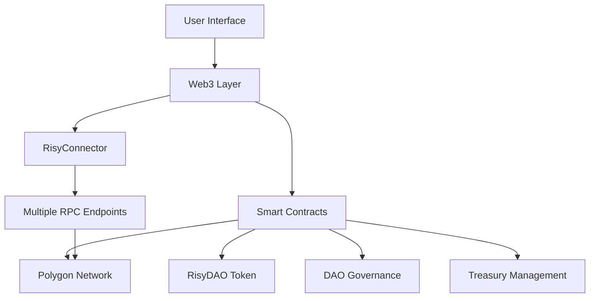

# Risy DAO

<p align="center">
  
</p>

<!-- Core Project Info -->
<p align="center">
  <a href="https://opensource.org/licenses/MIT"></a>
  <a href="https://polygonscan.com/token/0xca154cf88f6ffbc23e16b5d08a9bf4851fb97199"></a>
  <a href="https://polygonscan.com/token/0xca154cF88F6ffBC23E16B5D08a9Bf4851FB97199"></a>
  <a href="https://risy.io"></a>
</p>

<!-- Project Mirrors -->
<p align="center">
  <a href="https://risy.io"></a>
  <a href="https://risydao.github.io/Risy-DAO/"></a>
  <a href="https://ipfs.io/ipfs/bafybeibhq6qwgakj4lmcvgrknedys4w2beheru33byj2sat3x7il24k2ge"></a>
  <a href="https://dweb.link/ipfs/bafybeibhq6qwgakj4lmcvgrknedys4w2beheru33byj2sat3x7il24k2ge"></a>
</p>

<!-- Analytics & Trading -->
<p align="center">
  <a href="https://dune.com/risydao/risydaoanalytics"></a>
  <a href="https://quickswap.exchange/#/swap?currency0=ETH&swapIndex=1&currency1=0xca154cF88F6ffBC23E16B5D08a9Bf4851FB97199"></a>
  <a href="https://www.tally.xyz/gov/risydao"></a>
</p>

<!-- Documentation -->
<p align="center">
  <a href="https://risy.io/#docs"></a>
  <a href="https://risy.io/files/Risy%20DAO%20Whitepaper.pdf"></a>
  <a href="https://risy.io/files/Risy%20DAO%20Teknik%20Raporu.pdf"></a>
</p>

<!-- Community -->
<p align="center">
  <a href="https://twitter.com/RisyDAO"></a>
  <a href="https://t.me/RisyDAOCommunity"></a>
  <a href="https://discord.gg/zuSBq2XBjc"></a>
  <a href="https://risydao.medium.com"></a>
</p>

<!-- GitHub Stats -->
<p align="center">
  <a href="https://github.com/RisyDAO/Risy-DAO/issues"></a>
  <a href="https://github.com/RisyDAO/Risy-DAO/graphs/contributors"></a>
  <a href="https://github.com/RisyDAO/Risy-DAO/commits/main"></a>
</p>

Risy DAO is a revolutionary decentralized autonomous organization (DAO) built on the Polygon blockchain. It features a custom ERC20 token with advanced functionality and a governance system for decentralized decision-making, designed to solve common problems in the cryptocurrency space.

## Official Mirrors

- [Centralized Mirror](https://risy.io)
- [GitHub Mirror](https://risydao.github.io/Risy-DAO/)
- [IPFS Mirror](https://ipfs.io/ipfs/bafybeibhq6qwgakj4lmcvgrknedys4w2beheru33byj2sat3x7il24k2ge)
- [DWeb IPFS Mirror](https://dweb.link/ipfs/bafybeibhq6qwgakj4lmcvgrknedys4w2beheru33byj2sat3x7il24k2ge)
- [FLK-IPFS Mirror](https://bafybeibhq6qwgakj4lmcvgrknedys4w2beheru33byj2sat3x7il24k2ge.ipfs.flk-ipfs.xyz)

## Table of Contents

- [Features](#features)
- [Problem Solving](#problem-solving)
- [Smart Contracts](#smart-contracts)
- [Getting Started](#getting-started)
  - [Prerequisites](#prerequisites)
  - [Installation](#installation)
- [Usage](#usage)
  - [Interacting with Contracts](#interacting-with-contracts)
- [Testing](#testing)
- [Governance](#governance)
- [Security & Transparency](#security--transparency)
  - [Proofs & Transparency](#proofs--transparency)
- [Future Development](#future-development)
- [Tokenomics](#tokenomics)
  - [Initial Supply Distribution](#initial-supply-distribution)
  - [Token Details](#token-details)
  - [DAO Treasury](#dao-treasury)
- [Quick Start Guide](#quick-start-guide)
- [Security Measures](#security-measures)
- [Important Links](#important-links)
  - [Core Resources](#core-resources)
  - [Trading & Analytics](#trading--analytics)
  - [Tools & Resources](#tools--resources)
  - [Governance & Community](#governance--community)
  - [Social Media & Community](#social-media--community)
- [Contact](#contact)
- [License](#license)

## Features

- **Fully Decentralized**: Managed by KYC DAO (Owner is the DAO)
- **Capped Supply**: Maximum supply is 2x the initial supply
- **Daily Transfer Limit**: Whale protection mechanism based on a percentage of total balance (default 10%)
- **DAO Fee**: Fee on transfers for DAO maintenance, development, and marketing (default 0.1%)
- **ICO Max Balance Limit**: Whale protection mechanism to limit maximum token holdings (default 0.75% of total supply)
- **Trigger Mechanism**: For automation of tasks
- **Upgradeable**: Uses the UUPS proxy pattern for future upgrades
- **Governance**: Integrated with OpenZeppelin's Governor contract for decentralized decision-making
- **Endless Bull Market**: Revolutionary 10% daily sell limit creates a 10:1 buy-to-sell ratio, ensuring RISY's continuous rise and infinite bull market.
- **Stability & Funding**: Correlated with both USD and gold, providing stability against various market conditions.

## Problem Solving

Risy DAO addresses several critical issues in the cryptocurrency space:

1. **Centralization**: Unlike many cryptocurrencies, Risy DAO is fully decentralized, with ownership and decision-making power distributed among token holders.

2. **Whale Manipulation**: The 10% daily transfer limit and 0.75% temporary hodl limit during ICO prevent large holders from manipulating the market.

3. **Unfair Token Distribution**: These limits also ensure a more equitable distribution of tokens over time.

4. **Sustainability**: The 0.1% DAO fee on transfers funds ongoing development, marketing, and community initiatives, making the project self-sustaining.

5. **Market Stability**: By providing initial liquidity with 50% USDC and 50% PAXG, RISY maintains a unique correlation with both gold and USD, providing stability against various inflationary scenarios and bear markets in the broader cryptocurrency space.

6. **Scalability and Cost**: Built on the Polygon blockchain, Risy enables fast and affordable dApp development compared to Ethereum-based tokens.

7. **Continuous Improvement**: The DAO mechanism allows the project to evolve and upgrade itself indefinitely based on community decisions.

## Smart Contracts

1. `RisyDAO.sol`: Main contract for the Risy DAO Token
2. `RisyBase.sol`: Base contract with standard ERC20 functionality and upgradability
3. `RisyDAOManager.sol`: Governance contract for managing the DAO
4. `ITrigger.sol`: Interface for the trigger mechanism
5. `TriggerMock.sol`: Mock contract for testing the trigger functionality

## Getting Started

### Prerequisites

- Node.js (v14.0.0 or later)
- Yarn or npm
- Hardhat

### Installation

1. Clone the repository:
   ```
   git clone https://github.com/RisyDAO/Risy-DAO.git
   cd Risy-DAO
   ```

2. Install dependencies:
   ```
   yarn install
   ```
   or
   ```
   npm install
   ```

3. Compile the contracts:
   ```
   npx hardhat compile
   ```

## Usage

### Interacting with Contracts

You can interact with the deployed contracts using ethers.js. Here are some example interactions:

1. Connect to Polygon network:
   ```typescript
   const provider = new ethers.providers.JsonRpcProvider("https://polygon-rpc.com");
   // Or with MetaMask/Web3 provider
   const provider = new ethers.providers.Web3Provider(window.ethereum);
   await provider.send("eth_requestAccounts", []);
   ```

2. Load contracts:
   ```typescript
   const RISY_ABI = [
     "function name() view returns (string)",
     "function symbol() view returns (string)",
     "function decimals() view returns (uint8)",
     "function totalSupply() view returns (uint256)",
     "function balanceOf(address) view returns (uint256)",
     "function getTransferLimit() view returns (uint256, uint256)",
     "function getMaxBalance() view returns (uint256)",
     "function getDAOFee() view returns (uint256)",
     "function getVersion() view returns (uint256)"
   ];

   const risyDAO = new ethers.Contract(
     "0xca154cF88F6ffBC23E16B5D08a9Bf4851FB97199", 
     RISY_ABI, 
     provider
   );

   const risyDAOManager = new ethers.Contract(
     "0xD74E510a6472B20910ABCF8a3945E445b16aE11A",
     ["function propose(address[], uint256[], bytes[], string)"],
     provider.getSigner()
   );
   ```

3. Get token information:
   ```typescript
   const [name, symbol, decimals, totalSupply] = await Promise.all([
     risyDAO.name(),
     risyDAO.symbol(),
     risyDAO.decimals(),
     risyDAO.totalSupply()
   ]);

   const [transferLimitPercent, timeWindow] = await risyDAO.getTransferLimit();
   const maxBalance = await risyDAO.getMaxBalance();
   const daoFee = await risyDAO.getDAOFee();

   console.log("Token Info:", {
     name,
     symbol,
     decimals: decimals.toString(),
     totalSupply: ethers.utils.formatUnits(totalSupply, decimals),
     // transferLimitPercent is in ether units where 1 ether = 100%
     transferLimit: `${ethers.utils.formatEther(transferLimitPercent) * 100}% per ${timeWindow.toString()} seconds`,
     maxBalance: ethers.utils.formatUnits(maxBalance, decimals),
     // daoFee is in ether units where 1 ether = 100%
     daoFee: `${ethers.utils.formatEther(daoFee) * 100}%`
   });

   // Calculate max balance percentage of total supply
   const maxBalancePercent = maxBalance.mul(ethers.constants.WeiPerEther)
     .div(totalSupply)
     .mul(100);
   console.log("Max Balance Percent:", ethers.utils.formatUnits(maxBalancePercent, 18), "%");
   ```

4. Get price from Uniswap V2 pair:
   ```typescript
   const PAIR_ABI = [
     "function getReserves() view returns (uint112, uint112, uint32)",
     "function token0() view returns (address)",
     "function token1() view returns (address)"
   ];

   const USDC_DECIMALS = 6;
   const RISY_DECIMALS = 18;

   const pair = new ethers.Contract(
     "0xb908228A001CB177ac785659505EBCa1d9947EE8", // RISY/USDC pair
     PAIR_ABI,
     provider
   );

   const [reserve0, reserve1, timestamp] = await pair.getReserves();
   const token0 = await pair.token0();
   
   const RISY_ADDRESS = "0xca154cF88F6ffBC23E16B5D08a9Bf4851FB97199";
   const isToken0RISY = token0.toLowerCase() === RISY_ADDRESS.toLowerCase();
   
   // Calculate price considering decimal differences
   const price = isToken0RISY
     ? reserve1.mul(ethers.BigNumber.from(10).pow(RISY_DECIMALS - USDC_DECIMALS)).div(reserve0)
     : reserve0.mul(ethers.BigNumber.from(10).pow(RISY_DECIMALS - USDC_DECIMALS)).div(reserve1);

   console.log({
     price: ethers.utils.formatUnits(price, USDC_DECIMALS),
     risyReserve: ethers.utils.formatUnits(isToken0RISY ? reserve0 : reserve1, RISY_DECIMALS),
     usdcReserve: ethers.utils.formatUnits(isToken0RISY ? reserve1 : reserve0, USDC_DECIMALS),
     lastUpdate: new Date(timestamp * 1000).toISOString()
   });
   ```

5. Create a governance proposal:
   ```typescript
   // Example: Set DAO fee to 0.2%
   // Fee is in ether units where 1 ether = 100%
   // So 0.2% = 0.002 ether = 2e15 wei
   const newFee = ethers.utils.parseEther("0.002");
   
   const encodedFunctionCall = risyDAO.interface.encodeFunctionData(
     "setDAOFee", 
     [newFee]
   );

   await risyDAOManager.propose(
     [risyDAO.address],
     [0],
     [encodedFunctionCall],
     "Proposal to set DAO fee to 0.2%"
   );
   ```

6. Monitor events and format values correctly:
   ```typescript
   // Listen for transfers
   risyDAO.on("Transfer", async (from, to, amount) => {
     const decimals = await risyDAO.decimals();
     console.log({
       event: "Transfer",
       from,
       to,
       amount: ethers.utils.formatUnits(amount, decimals),
       timestamp: new Date().toISOString()
     });
   });

   // Get historical transfers with proper formatting
   const filter = risyDAO.filters.Transfer();
   const events = await risyDAO.queryFilter(filter, -1000);
   const decimals = await risyDAO.decimals();
   
   const formattedEvents = events.map(event => ({
     from: event.args.from,
     to: event.args.to,
     amount: ethers.utils.formatUnits(event.args.value, decimals),
     blockNumber: event.blockNumber
   }));

   console.log("Recent transfers:", formattedEvents);
   ```

7. Calculate ROI and profit metrics:
   ```typescript
   const calculateROI = async (
     initialInvestment: number,
     days: number,
     dailyReturn: number
   ) => {
     // Convert percentages to decimals
     const dailyReturnDecimal = dailyReturn / 100;
     
     // Calculate final amount using compound interest
     const finalAmount = initialInvestment * 
       Math.pow((1 + dailyReturnDecimal), days);
     
     // Calculate metrics
     const profit = finalAmount - initialInvestment;
     const roi = (profit / initialInvestment) * 100;
     const daysToDouble = Math.log(2) / Math.log(1 + dailyReturnDecimal);
     
     return {
       initialInvestment,
       finalAmount,
       profit,
       roi,
       daysToDouble,
       dailyReturn,
       days
     };
   };

   // Example usage
   const metrics = await calculateROI(1000, 365, 1);
   console.log({
     "Initial Investment": `$${metrics.initialInvestment}`,
     "Final Amount": `$${metrics.finalAmount.toFixed(2)}`,
     "Profit": `$${metrics.profit.toFixed(2)}`,
     "ROI": `${metrics.roi.toFixed(2)}%`,
     "Days to Double": Math.ceil(metrics.daysToDouble),
     "Daily Return": `${metrics.dailyReturn}%`,
     "Time Period": `${metrics.days} days`
   });
   ```

8. Monitor market metrics:
   ```typescript
   const getMarketMetrics = async () => {
     const risyDAO = new ethers.Contract(
       "0xca154cF88F6ffBC23E16B5D08a9Bf4851FB97199",
       RISY_ABI,
       provider
     );

     // Get basic token info
     const [totalSupply, maxBalance, daoFee] = await Promise.all([
       risyDAO.totalSupply(),
       risyDAO.getMaxBalance(),
       risyDAO.getDAOFee()
     ]);

     // Get price from RISY/USDC pair
     const pair = new ethers.Contract(
       "0xb908228A001CB177ac785659505EBCa1d9947EE8",
       PAIR_ABI,
       provider
     );

     const [reserves, token0] = await Promise.all([
       pair.getReserves(),
       pair.token0()
     ]);

     const isToken0RISY = token0.toLowerCase() === risyDAO.address.toLowerCase();
     const [risyReserve, usdcReserve] = isToken0RISY ? 
       [reserves[0], reserves[1]] : [reserves[1], reserves[0]];

     // Calculate price (considering USDC has 6 decimals)
     const price = usdcReserve.mul(ethers.BigNumber.from(10).pow(12))
       .div(risyReserve);

     // Calculate market metrics
     const marketCap = totalSupply.mul(price).div(ethers.BigNumber.from(10).pow(18));
     const maxHoldingValue = maxBalance.mul(price).div(ethers.BigNumber.from(10).pow(18));

     return {
       price: ethers.utils.formatUnits(price, 6),
       marketCap: ethers.utils.formatUnits(marketCap, 6),
       maxHoldingValue: ethers.utils.formatUnits(maxHoldingValue, 6),
       risyReserve: ethers.utils.formatEther(risyReserve),
       usdcReserve: ethers.utils.formatUnits(usdcReserve, 6),
       daoFee: `${ethers.utils.formatEther(daoFee) * 100}%`
     };
   };

   // Example usage with real-time updates
   const monitorMarket = async () => {
     try {
       const metrics = await getMarketMetrics();
       console.log({
         "Price": `$${metrics.price}`,
         "Market Cap": `$${metrics.marketCap}`,
         "Max Holding Value": `$${metrics.maxHoldingValue}`,
         "RISY Liquidity": `${metrics.risyReserve} RISY`,
         "USDC Liquidity": `$${metrics.usdcReserve}`,
         "DAO Fee": metrics.daoFee
       });
     } catch (error) {
       console.error("Error fetching market metrics:", error);
     }
   };

   // Update every 30 seconds
   setInterval(monitorMarket, 30000);
   ```

9. Track holder statistics:
   ```typescript
   const getHolderStats = async () => {
     const risyDAO = new ethers.Contract(
       "0xca154cF88F6ffBC23E16B5D08a9Bf4851FB97199",
       RISY_ABI,
       provider
     );

     // Get transfer events for the last 1000 blocks
     const filter = risyDAO.filters.Transfer();
     const events = await risyDAO.queryFilter(filter, -1000);

     // Track unique addresses and their balances
     const holders = new Map();
     for (const event of events) {
       const { from, to, value } = event.args;
       
       // Update sender balance
       if (from !== ethers.constants.AddressZero) {
         const fromBalance = await risyDAO.balanceOf(from);
         holders.set(from, fromBalance);
       }
       
       // Update receiver balance
       const toBalance = await risyDAO.balanceOf(to);
       holders.set(to, toBalance);
     }

     // Calculate statistics
     const totalHolders = holders.size;
     const nonZeroHolders = Array.from(holders.values())
       .filter(balance => !balance.isZero()).length;
     
     const balances = Array.from(holders.values())
       .map(b => parseFloat(ethers.utils.formatEther(b)));
     
     const averageBalance = balances.reduce((a, b) => a + b, 0) / nonZeroHolders;
     const maxHolding = Math.max(...balances);
     const minNonZeroHolding = Math.min(...balances.filter(b => b > 0));

     return {
       totalHolders,
       nonZeroHolders,
       averageBalance,
       maxHolding,
       minNonZeroHolding,
       recentTransactions: events.length
     };
   };

   // Example usage
   const stats = await getHolderStats();
   console.log({
     "Total Holders": stats.totalHolders,
     "Active Holders": stats.nonZeroHolders,
     "Average Balance": `${stats.averageBalance.toFixed(2)} RISY`,
     "Largest Holder": `${stats.maxHolding.toFixed(2)} RISY`,
     "Smallest Active Holder": `${stats.minNonZeroHolding.toFixed(2)} RISY`,
     "Recent Transactions": stats.recentTransactions
   });
   ```

## Testing

To run the extensive test suite:

```
npx hardhat test
```

Our project features hundreds of carefully crafted tests covering various scenarios, ensuring the robustness and security of the smart contracts.

## Governance

Risy DAO uses a governance system based on OpenZeppelin's Governor contract. Key features include:

- Proposal creation and execution
- Voting mechanisms (For, Against, Abstain)
- Quorum requirements
- Time-based voting periods

Token holders can participate in governance by:
1. Delegating their voting power
2. Creating proposals (if they meet the proposal threshold)
3. Voting on active proposals

## Security & Transparency

Security is a top priority for Risy DAO:

- The contract uses OpenZeppelin's battle-tested implementations as a foundation
- Upgrade functionality is restricted to the DAO through governance
- Daily transfer limits and max balance limits provide protection against large, malicious transactions
- Extensive test coverage ensures contract behavior under various conditions
- The project goes a professional security audit before mainnet deployment

### Proofs & Transparency
- **Liquidity Lock Proofs**:
  - [RISY/USDC LP Tokens](https://polygonscan.com/token/0xb908228a001cb177ac785659505ebca1d9947ee8#balances)
  - [RISY/PAXG LP Tokens](https://polygonscan.com/token/0x8341b5240e05552d85e78bcd691b2982c3e4deaf#balances)
- **Ownership & Distribution**:
  - [Token Ownership Transfer Proof](https://polygonscan.com/tx/0xd04847dda53dea80b428c2613eff3a824295b57bf2aac2e350e0601be596053a#eventlog)
  - [Creator 1 (Developer) Balance](https://polygonscan.com/token/0xca154cf88f6ffbc23e16b5d08a9bf4851fb97199?a=0x1CdF17441D2FDC1bd317D862b0916D32F1aC780d)
  - [Creator 2 (Investor) Balance](https://polygonscan.com/token/0xca154cf88f6ffbc23e16b5d08a9bf4851fb97199?a=0xFbCEa4A93af36338Ce4678da4C39F5748e743ef7)
  - [Token Holders List](https://polygonscan.com/token/0xca154cf88f6ffbc23e16b5d08a9bf4851fb97199#balances)

## Tokenomics

- **Initial Supply**: 1,000,000,000,000 RISY
- **Maximum Supply**: 2x initial supply
- **Creator Holdings**: Only 2% of initial supply
- **Initial Liquidity**: $20,000 (50% USDC, 50% PAXG)
- **DAO Fee**: 0.1% on each transfer
- **Daily Transfer Limit**: 10% of balance
- **Temporary Hodl Limit for the ICO**: 0.75% during ICO

Key points:
- Correlation with both USD and gold provides stability
- DAO fee funds ongoing development and community initiatives
- Exemption of DEX buys from daily limits encourages purchasing (approximately 10:1 buy-to-sell ratio)
- Built on Polygon for fast and affordable transactions

### Initial Supply Distribution
- **RISY/USDC Liquidity**: 48%
- **RISY/PAXG Liquidity**: 48%
- **Creator 1 (Developer)**: 2%
- **Creator 2 (Investor)**: 2%

*Note: No initial supply is allocated for advertising, marketing, airdrops, or team financing. The 0.1% DAO fee is more than sufficient for these purposes, providing a long-term solution rather than a short-term fix.*

### Token Details
- **Contract Address**: `0xca154cF88F6ffBC23E16B5D08a9Bf4851FB97199`
- **Chain**: Polygon Mainnet (Chain ID: 137 / 0x89)
- **Decimals**: 18
- **Launch Date**: Jul-03-2024 05:56:16 PM UTC

### DAO Treasury
- Unspent DAO revenues are distributed as dividends to hodlers
- Treasury balance and value can be monitored on [PolygonScan](https://polygonscan.com/token/0xca154cf88f6ffbc23e16b5d08a9bf4851fb97199?a=0xD74E510a6472B20910ABCF8a3945E445b16aE11A)

## Future Development

Our roadmap outlines ambitious plans for future development:

### Q3 2024
- Launch of Risy DAO and RISY token on Polygon mainnet
- Initial DEX offering (IDO) and liquidity provision
- Governance platform launch

### Q4 2024
- First community governance proposals
- Development of initial dApp prototypes
- Strategic partnerships with other blockchain projects

### Q1 2025
- Launch of first Risy DAO-powered DeFi application
- Integration with major wallets and exchanges
- Begin development of gaming ecosystem

### Q2 2025
- Introduction of cross-chain bridging solutions
- Launch of Risy DAO incubator for community-driven projects
- Expansion of governance capabilities

## Important Links

### Core Resources
- **Smart Contract**: [View on PolygonScan](https://polygonscan.com/token/0xca154cf88f6ffbc23e16b5d08a9bf4851fb97199#code)
- **Documentation**: [English Whitepaper](https://risy.io/files/Risy%20DAO%20Whitepaper.pdf) | [Turkish Whitepaper](https://risy.io/files/Risy%20DAO%20Teknik%20Raporu.pdf)
- **Getting Started**: [How to Get RISY Guide](https://risydao.medium.com/the-9-steps-not-10-hitchhikers-guide-to-defi-f6d767f264cd)
- **DAO Contract**: [View on PolygonScan](https://polygonscan.com/address/0xD74E510a6472B20910ABCF8a3945E445b16aE11A#code)

### Trading & Analytics
- **DEX**: [Trade on QuickSwap](https://quickswap.exchange/#/swap?currency0=ETH&swapIndex=1&currency1=0xca154cF88F6ffBC23E16B5D08a9Bf4851FB97199)
- **Price Chart**: [GeckoTerminal](https://www.geckoterminal.com/polygon_pos/pools/0xb908228a001cb177ac785659505ebca1d9947ee8)
- **Analytics Dashboard**: [Dune Analytics](https://dune.com/risydao/risydaoanalytics)
- **Alternative DEXs**: Available on various Polygon DEXs
- **Token Info**: [View on PolygonScan](https://polygonscan.com/token/0xca154cf88f6ffbc23e16b5d08a9bf4851fb97199)

### Tools & Resources
- **Profit Calculator**: Available on [Official Website](https://risy.io)
- **On-chain Data**: Real-time metrics available on [Official Website](https://risy.io)
- **Alternative Mirrors**: For better availability and accessibility

### Governance & Community
- **DAO Portal**: [Tally](https://www.tally.xyz/gov/risydao)
- **Earn Free RISY**: [Galxe](https://app.galxe.com/quest/RisyDAO)
- **Press Kit**: [Download](https://risy.io/press-kit.zip)
- **Voting Power**: Proportional to RISY holdings
- **Proposal Threshold**: Set by DAO
- **Voting Period**: Time-based voting system
- **Delegation**: Ability to delegate voting power

### Social Media & Community
- **X (Twitter)**: [@RisyDAO](https://twitter.com/RisyDAO)
- **Telegram**: [Community Chat](https://t.me/RisyDAOCommunity)
- **Discord**: [Community Server](https://discord.gg/zuSBq2XBjc)
- **Medium**: [Blog](https://risydao.medium.com)
- **GitHub**: [Source Code](https://github.com/RisyDAO)

## Contact

For any inquiries or support, please contact:

- Email: info@risy.io
- Website: [https://risy.io](https://risy.io)
- X (Twitter): [@RisyDAO](https://twitter.com/RisyDAO)
- Telegram: [Risy DAO Community](https://t.me/RisyDAOCommunity)
- Discord: [Risy DAO Community](https://discord.gg/zuSBq2XBjc)
- Medium: [Risy DAO](https://risydao.medium.com)
- Whitepaper: [Risy DAO Whitepaper](https://risy.io/files/Risy%20DAO%20Whitepaper.pdf)
- DAO: [Risy DAO](https://www.tally.xyz/gov/risydao)
- Smart Contract: [Risy DAO on PolygonScan](https://polygonscan.com/token/0xca154cF88F6ffBC23E16B5D08a9Bf4851FB97199)
- DEX: [Risy DAO on QuickSwap](https://quickswap.exchange/#/swap?currency0=ETH&swapIndex=1&currency1=0xca154cF88F6ffBC23E16B5D08a9Bf4851FB97199)

## License

This project is licensed under the MIT License. See the [LICENSE](LICENSE) file for details.

---

Made with passion and coffee for blockchain nerds by blockchain nerds. Rise with RISY! 🚀

*Note: Always verify contract addresses and links by checking official sources. The information provided here is accurate as of the launch date (Jul-03-2024).*

## Quick Start Guide

### 🦊 1. Set Up Your Wallet
- Install [MetaMask](https://metamask.io/download/) or any Polygon-compatible wallet
- Create a new wallet or import your existing one
- Keep your seed phrase secure and never share it

### 💜 2. Add Polygon Network
- Network Name: `Polygon Mainnet`
- RPC URL: `https://polygon-rpc.com`
- Chain ID: `137`
- Currency Symbol: `MATIC`
- Block Explorer: `https://polygonscan.com`

### 💰 3. Get MATIC Tokens
- Purchase MATIC from an exchange
- Transfer to your Polygon wallet
- You'll need MATIC for gas fees

### ✨ 4. Add RISY Token
- Visit [risy.io](https://risy.io)
- Click "Add to Wallet"
- Or manually add:
  - Contract: `0xca154cF88F6ffBC23E16B5D08a9Bf4851FB97199`
  - Symbol: `RISY`
  - Decimals: `18`

### 💱 5. Get RISY
- Visit [QuickSwap](https://quickswap.exchange/#/swap?currency0=ETH&swapIndex=1&currency1=0xca154cF88F6ffBC23E16B5D08a9Bf4851FB97199)
- Connect your wallet
- Swap MATIC or other tokens for RISY
- Remember the 0.75% max balance limit during ICO

### 🏛️ 6. Join DAO
- Visit [Tally](https://www.tally.xyz/gov/risydao)
- Connect your wallet
- Start participating in governance

## Security Measures

### 🛡️ Core Security Features
- ✅ Professional Security Audit (In Progress)
- ✅ Battle-tested OpenZeppelin Contracts
- ✅ Multi-signature DAO Treasury
- ✅ Time-lock on Critical Functions
- ✅ Extensive Test Coverage

### 🐋 Anti-Whale Mechanisms
- ✅ 10% Daily Transfer Limit
- ✅ 0.75% Max Balance During ICO
- ✅ DEX Purchase Exceptions
- ✅ Gradual Token Distribution

### 🔒 Smart Contract Security
- ✅ UUPS Proxy Pattern
- ✅ Access Control Implementation
- ✅ Reentrancy Protection
- ✅ Integer Overflow Protection
- ✅ Gas Optimization

### 📊 Transparency Measures
- ✅ Open Source Code
- ✅ Public Audit Reports
- ✅ Real-time Analytics
- ✅ On-chain Verification
- ✅ Community Governance

### 🔄 Continuous Security
- ✅ Regular Security Updates
- ✅ Community Bug Bounty Program
- ✅ Automated Monitoring
- ✅ Emergency Response Plan
- ✅ Security Documentation

## Frequently Asked Questions

### 🤔 General Questions

**Q: What is Risy DAO and why is it revolutionary?**
A: Risy DAO is a groundbreaking decentralized autonomous organization built on the Polygon blockchain. What sets it apart is its innovative tokenomics, particularly the 10% daily sell limit. This unique feature creates an unprecedented 10:1 buy-to-sell ratio, resulting in an endless bull market for RISY tokens.

**Q: How does the 10% daily sell limit work?**
A: The 10% daily sell limit restricts token holders from selling more than 10% of their balance in a 24-hour period. This creates a natural 10:1 demand-to-supply ratio in the market, ensuring there's always more buying pressure than selling pressure.

**Q: How does Risy DAO ensure long-term stability?**
A: Risy DAO combines several features for stability:
- 10% daily sell limit creates consistent upward pressure
- Correlation with both USD and gold through liquidity pairs
- 0.1% DAO fee funds continuous development
- Built on fast and cost-effective Polygon blockchain
- Robust governance model for community-driven evolution

### 💰 Investment Questions

**Q: Where can I buy RISY tokens?**
A: RISY tokens are available on QuickSwap and other Polygon DEXs. Visit our [How to Get RISY Guide](https://risydao.medium.com/the-9-steps-not-10-hitchhikers-guide-to-defi-f6d767f264cd) for detailed instructions.

**Q: What is the maximum amount I can hold during ICO?**
A: During the ICO period, there's a temporary 0.75% (~=7,500,000,000 RISY) hodl limit to ensure fair distribution and prevent whale accumulation.

**Q: How are DAO revenues distributed?**
A: Unspent DAO revenues are automatically distributed as dividends to token holders, creating a sustainable reward system.

### 🏛️ Governance Questions

**Q: How can I participate in governance?**
A: Token holders can:
1. Vote on proposals
2. Create new proposals (if meeting threshold)
3. Delegate voting power
4. Participate in community discussions

**Q: What can be governed through DAO?**
A: The DAO can govern:
- Protocol parameters
- Treasury management
- Feature upgrades
- Strategic decisions
- Community initiatives

### 🔧 Technical Questions

**Q: Why was Polygon chosen as the blockchain?**
A: Polygon offers:
- Fast transactions
- Low gas fees
- Ethereum compatibility
- Strong developer ecosystem
- High scalability

**Q: How secure is the smart contract?**
A: Our security measures include:
- Professional audits
- Battle-tested OpenZeppelin contracts
- Extensive test coverage
- Multi-signature controls
- Time-locked critical functions

## Contributing to Risy DAO

### 🌟 Ways to Contribute

1. **Code Contributions**
   - Fork the repository
   - Create a feature branch
   - Submit pull requests
   - Follow coding standards
   - Include tests

2. **Documentation**
   - Improve README
   - Write tutorials
   - Create guides
   - Translate content

3. **Community Support**
   - Help new users
   - Answer questions
   - Share knowledge
   - Report bugs

4. **Content Creation**
   - Write articles
   - Create videos
   - Design graphics
   - Share on social media

### 📝 Contribution Guidelines

1. **Code Standards**
   - Follow Solidity style guide
   - Use TypeScript for frontend
   - Write clean, documented code
   - Include comprehensive tests
   - Follow security best practices

2. **Pull Request Process**
   - Create descriptive PRs
   - Reference issues
   - Update documentation
   - Add test cases
   - Wait for review

3. **Issue Reporting**
   - Use issue templates
   - Provide clear descriptions
   - Include reproduction steps
   - Add relevant labels
   - Follow up on feedback

4. **Communication**
   - Join Discord/Telegram
   - Participate in discussions
   - Be respectful and helpful
   - Follow code of conduct
   - Stay active in community

### 🎯 Development Focus Areas

1. **Smart Contracts**
   - Security improvements
   - Gas optimizations
   - Feature additions
   - Integration capabilities

2. **Frontend Development**
   - UI/UX improvements
   - Performance optimization
   - Mobile responsiveness
   - New features

3. **Documentation**
   - Technical docs
   - User guides
   - API documentation
   - Tutorials

4. **Testing**
   - Unit tests
   - Integration tests
   - Security tests
   - Performance tests

## Technical Architecture

### 🏗️ System Overview



### 🔄 Core Components

1. **Smart Contract Layer**
   - UUPS Proxy Pattern for upgradeability
   - OpenZeppelin's secure contract base
   - Custom transfer limit mechanism
   - DAO governance integration
   - Treasury management system

2. **Web3 Integration Layer**
   - RisyConnector for reliable RPC connections
   - Multi-provider fallback system
   - Caching mechanism for optimization
   - Real-time data synchronization
   - Event monitoring system

3. **Frontend Architecture**
   - Progressive Web App (PWA)
   - Responsive design system
   - Real-time price updates
   - Interactive governance interface
   - Multi-language support

4. **Backend Services**
   - Distributed RPC management
   - Event indexing system
   - Analytics data aggregation
   - Cache management
   - Security monitoring

### 🔧 Technical Specifications

1. **Smart Contract**
   - Language: Solidity 0.8.19
   - Framework: Hardhat
   - Test Coverage: >95%
   - Audit Status: In Progress
   - Deployment: Polygon Mainnet

2. **Frontend**
   - Framework: Alpine.js
   - Styling: Tailwind CSS
   - Web3: ethers.js
   - Build Tool: Webpack
   - Hosting: Distributed (Multiple Mirrors)

3. **Performance**
   - Transaction Speed: <5s
   - UI Response Time: <100ms
   - Cache Duration: 30s
   - RPC Fallback Time: <1s
   - Auto-scaling Enabled

4. **Security**
   - Multi-sig Controls
   - Rate Limiting
   - DDoS Protection
   - Real-time Monitoring
   - Automated Alerts

## Risk Disclaimer

### ⚠️ Investment Risks

1. **Market Volatility**
   - Cryptocurrency prices can be highly volatile
   - Past performance does not guarantee future results
   - Market conditions can change rapidly
   - External factors may impact token value
   - Always invest what you can afford to lose

2. **Technical Risks**
   - Smart contract vulnerabilities
   - Network congestion
   - Gas price fluctuations
   - Blockchain network issues
   - Software bugs or errors

3. **Regulatory Risks**
   - Changing cryptocurrency regulations
   - Regional restrictions
   - Tax implications
   - Compliance requirements
   - Legal framework changes

### 🔍 Due Diligence

1. **DYOR (Do Your Own Research)**
   - Read the whitepaper thoroughly
   - Understand the tokenomics
   - Review smart contract code
   - Check audit reports
   - Monitor community discussions

2. **Security Best Practices**
   - Use secure wallets
   - Enable 2FA where possible
   - Never share private keys
   - Verify all transaction details
   - Keep software updated

3. **Risk Management**
   - Diversify investments
   - Set realistic expectations
   - Monitor your positions
   - Use secure networks
   - Keep records of transactions

### 📜 Legal Notice

This document and the Risy DAO project do not constitute financial advice. Cryptocurrency investments carry high risk, and you should consult with financial, legal, and tax professionals before making any investment decisions.

1. **No Guarantees**
   - Returns are not guaranteed
   - Token price can fluctuate
   - Project development timelines may change
   - Features may be modified
   - Market conditions are unpredictable

2. **Jurisdiction**
   - Users must comply with local laws
   - Some features may be restricted in certain regions
   - Tax obligations vary by jurisdiction
   - Regulatory requirements may change
   - Users are responsible for compliance

3. **Liability**
   - Project team is not liable for losses
   - Users assume all investment risks
   - No warranty for uninterrupted service
   - Technical issues may occur
   - Market dynamics are beyond control

### 🎯 Risk Mitigation

1. **Project Measures**
   - Professional security audits
   - Transparent governance
   - Regular updates
   - Community-driven decisions
   - Emergency procedures

2. **User Recommendations**
   - Start with small amounts
   - Understand the technology
   - Follow security guidelines
   - Stay informed
   - Participate in governance

3. **Emergency Procedures**
   - Contact support immediately for issues
   - Follow official announcements
   - Use emergency shutdown if available
   - Report suspicious activities
   - Keep transaction records

## Project Comparison

### 🔄 DeFi Protocol Comparison

| Feature                    | Risy DAO | Traditional DeFi | Other DAOs | CEX Tokens |
|---------------------------|----------|------------------|------------|------------|
| **Market Mechanics**      |          |                  |            |            |
| Guaranteed Bull Market    | ✅       | ❌               | ❌         | ❌         |
| Buy/Sell Ratio Control    | ✅ 10:1  | ❌               | ❌         | ❌         |
| Whale Protection          | ✅       | ❌               | ⚠️         | ❌         |
| Price Stability           | ✅       | ❌               | ⚠️         | ⚠️         |
| **Economic Model**        |          |                  |            |            |
| Gold Correlation          | ✅       | ❌               | ❌         | ❌         |
| USD Correlation           | ✅       | ⚠️               | ⚠️         | ✅         |
| DAO Revenue Distribution  | ✅       | ⚠️               | ✅         | ❌         |
| Sustainable Funding       | ✅       | ⚠️               | ⚠️         | ✅         |
| **Governance**            |          |                  |            |            |
| Decentralized Control     | ✅       | ⚠️               | ✅         | ❌         |
| Community Voting          | ✅       | ⚠️               | ✅         | ❌         |
| Transparent Treasury      | ✅       | ⚠️               | ✅         | ❌         |
| Upgradeable Contracts     | ✅       | ⚠️               | ✅         | ❌         |
| **Technical**             |          |                  |            |            |
| Low Gas Fees             | ✅       | ❌               | ⚠️         | ✅         |
| Fast Transactions        | ✅       | ❌               | ⚠️         | ✅         |
| Smart Contract Security  | ✅       | ✅               | ✅         | N/A        |
| Open Source Code        | ✅       | ✅               | ✅         | ❌         |

Legend:
- ✅ Fully Supported
- ⚠️ Partially Supported
- ❌ Not Supported
- N/A Not Applicable

### 💡 Key Differentiators

1. **Market Mechanics**
   - Only Risy DAO guarantees a bull market through tokenomics
   - Unique 10:1 buy/sell ratio mechanism
   - Built-in whale protection mechanisms

2. **Economic Stability**
   - Dual correlation with both gold and USD
   - Sustainable revenue model through DAO fee
   - Fair token distribution model

3. **Technical Innovation**
   - Advanced RPC management system
   - Multi-provider fallback mechanism
   - Optimized gas usage

## Extended Risk Disclaimer

### 🎯 Risk-Reward Profile

| Risk Category | Level | Mitigation Measures |
|--------------|-------|-------------------|
| Market Risk | Medium | - 10:1 buy/sell ratio<br>- Gold/USD correlation<br>- Transfer limits |
| Technical Risk | Low | - Audited contracts<br>- Multiple security layers<br>- Continuous monitoring |
| Regulatory Risk | Medium | - DAO structure<br>- Compliance focus<br>- Legal reviews |
| Operational Risk | Low | - Multi-sig controls<br>- Emergency procedures<br>- Community governance |

### 🔒 Security Framework

1. **Smart Contract Security**
   ```mermaid
   graph TD
       A[Smart Contract] --> B[Audit Layer]
       B --> C[OpenZeppelin Base]
       B --> D[Custom Security]
       D --> E[Transfer Limits]
       D --> F[Balance Limits]
       D --> G[DAO Controls]
   ```

2. **Risk Management Hierarchy**
   ```mermaid
   graph TD
       A[Risk Management] --> B[Prevention]
       A --> C[Detection]
       A --> D[Response]
       B --> E[Security Audits]
       B --> F[Code Reviews]
       C --> G[Monitoring]
       C --> H[Alerts]
       D --> I[Emergency Plans]
       D --> J[Recovery Procedures]
   ```

### ⚖️ Regulatory Considerations

1. **Compliance Framework**
   - DeFi-specific regulations
   - Cross-border considerations
   - KYC/AML implications
   - Tax reporting requirements
   - Privacy regulations

2. **Jurisdictional Variations**
   - Regional restrictions
   - Licensing requirements
   - Reporting obligations
   - User responsibilities
   - Compliance updates
